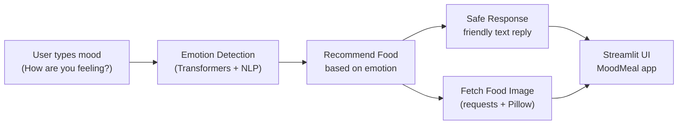

# Mood-Based Food Recommender 🧠🍽️

> *Feel. Eat. Heal.* — An AI-powered MoodMeal assistant that turns your emotions into comforting food suggestions.


---

## Overview

MoodMeal is a mood-aware food recommender that suggests meals based on how you feel.  
You tell the app your current mood in natural language, it detects the underlying emotion using an NLP model, and then recommends a suitable dish along with a friendly, safe response and an illustrative image.

The goal is to combine **emotional awareness** with **food recommendation** in a simple, interactive Streamlit app.

---

## How It Works



1. **User input** – You type how you are feeling today in free text.  
2. **Emotion detection** – A model (built with `transformers`, `torch`, and `nltk`) detects the dominant emotion and the probability distribution over emotions.  
3. **Food recommendation** – Based on the detected emotion, the app chooses an appropriate dish (e.g., comfort food for sadness, lighter meals for stress).  
4. **Safe response** – The app generates a friendly, safe, and empathetic text response that combines your mood and the suggested food.  
5. **Food image** – A representative food image is fetched (e.g., via an API or local images) and displayed in the UI.  
6. **Streamlit UI** – Everything is presented in a clean web interface built with Streamlit.

---

## Project Structure

```text
mood-based-food-recommender/
├─ APP_streamlit.py              # Streamlit UI for MoodMeal
├─ app.py                        # Core backend logic (emotion detection, food recommendation, etc.)
├─ Mood_Meal_chatbot.ipynb       # Notebook for prototyping and experiments
├─ moodmeal_feedback.csv         # Collected user feedback (ratings/comments)
├─ requirements.txt              # Python dependencies
├─ MoodMeal_Project_Enhancement_Plan.pdf  # Design and enhancement plan
├─ Requirements/                 # Additional requirement / spec documents
├─ .gitignore
└─ README.md
```

- **APP_streamlit.py** – Entry point of the web app. Handles user input, calls the backend functions, and renders charts/images.  
- **app.py** – Implements:
  - `detect_emotion(text)` – runs the NLP model to classify mood and return scores.
  - `recommend_food(emotion)` – maps emotions to candidate foods.
  - `safe_response(emotion, food)` – generates a friendly, safe reply for the UI.
  - `get_food_image(food)` – fetches an image for the recommended dish.  
- **Mood_Meal_chatbot.ipynb** – Used for experimenting with different models, prompts, or recommendation logic.  
- **moodmeal_feedback.csv** – Stores feedback data (can be used to analyze user satisfaction or refine recommendations).  

---

## Installation

1. **Clone the repository**

   ```bash
   git clone https://github.com/rika1089/mood-based-food-recommender.git
   cd mood-based-food-recommender
   ```

2. **Create and activate a virtual environment** (recommended)

   ```bash
   python -m venv .venv
   # On Linux / macOS:
   source .venv/bin/activate
   # On Windows:
   .venv\Scripts\activate
   ```

3. **Install dependencies**

   Make sure the requirements file is named `requirements.txt` and contains:

   ```text
   streamlit>=1.26.0
   transformers>=4.40.0
   torch>=2.1.0
   nltk>=3.8.1
   requests>=2.31.0
   Pillow>=10.0.0
   ```

   Then install:

   ```bash
   pip install -r requirements.txt
   ```

---

## Running the App

From the project root:

```bash
streamlit run APP_streamlit.py
```

Streamlit will print a local URL (typically `http://localhost:8501`). Open it in your browser.

### What you’ll see

- A text box: **“How are you feeling today?”**  
- After you type your mood and submit:
  - The detected emotion and a confidence percentage.  
  - A bar chart showing the probability distribution over emotions.  
  - A progress bar indicating model confidence.  
  - A “MoodMeal” response explaining the recommendation.  
  - A food image representing the suggested dish.

---

## Future Enhancements

Some ideas to extend MoodMeal:

- **Better emotion detection** – Experiment with different transformer models or fine-tune on emotion datasets for more accurate mood classification.  
- **Richer recommendation logic** – Incorporate time of day, dietary preferences (veg/non‑veg), or health goals (high‑protein, low‑carb, etc.).  
- **Feedback loop** – Use `moodmeal_feedback.csv` to learn which recommendations users actually liked and adjust mappings over time.  
- **User history** – Add simple user IDs and keep a history of moods and meals to personalize future suggestions.  
- **Deployment** – Deploy to Streamlit Cloud, Render, or another hosting service so others can try MoodMeal without local setup.

---

## Acknowledgements

- Built with 💚 using [Streamlit](https://streamlit.io/) for the UI.  
- Emotion detection powered by the Hugging Face `transformers` ecosystem and PyTorch.  
- Inspired by the idea of using food as a gentle way to support emotional well‑being.
